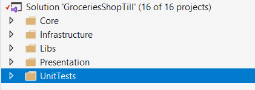
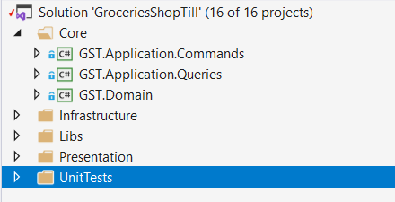
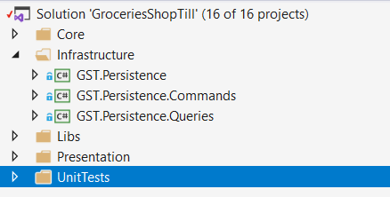
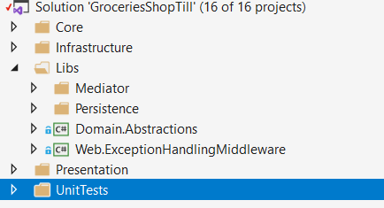
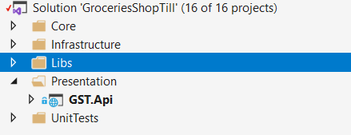
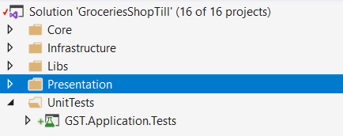

# Developer Exercise

This update on the original ReadMe file is intented to provide a brief explanation of the current author's chance to provide an architecture and an overall idea of an implementation of the initial project requirements.

## Project Structure
This is the initial project structure

There are 5 folders.

Starting from the **first**:

The Core folder contains 3 projects:
- Application.Commands
- Application.Queries
- Domain

**Second**: Application

- Persistence
- Persistence.Commands
- Persistence.Queries

**Third**: Libs

- Mediator folder, containing projects related to the setup of the Mediator
- Persistence folder, containing projects related to the overall abstraction layer for the persistence layer.
- Domain project, related to the overall abstraction of the domain layer in the project
- ExceptionHandlingMiddleware, providing a pipeline for handling thrown exceptions

**Forth**: Presentation

- Api, which serves as an endpoint for clients( i.e. Angular client, React client, etc)

**Fifth**: UnitTests

- Test project for tests related to the business layer

                                            
##The idea

 
